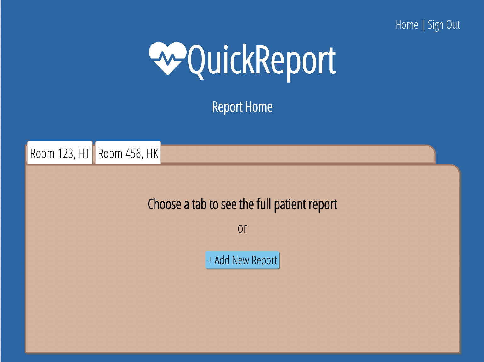
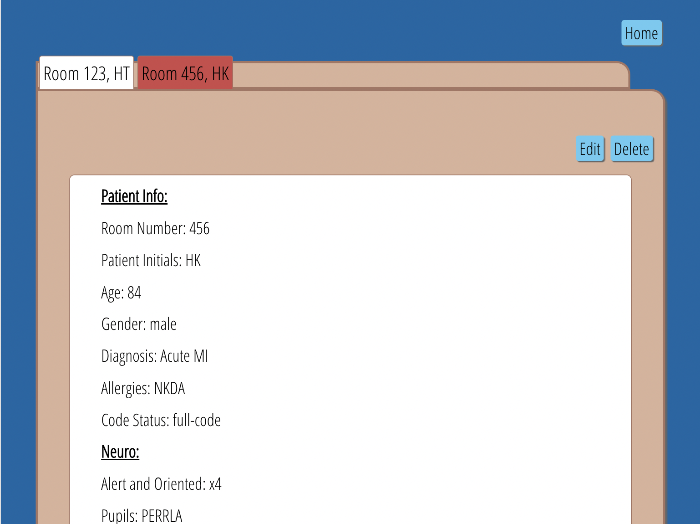
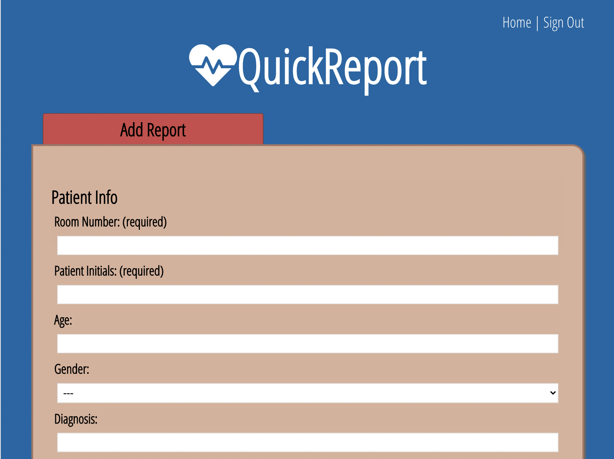
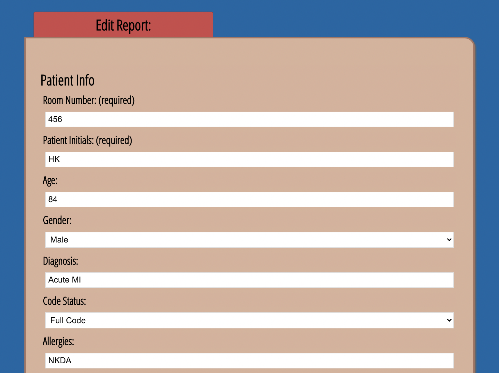

# QuickReport

## Summary

QuickReport is a full-stack PERN app designed to help nurses and other healthcare professionals take report (gather details) on their patients. The user is able to view, create, edit and delete multiple patient reports.

The QuickReport API utilizes GET, POST, PATCH and DELETE endpoints along with the corresponding postgreSQL databases. The app's client-side was also written by me and can be viewed [here](https://github.com/SabrinaSides/quick-report-client).

## See the App Live

[Check It Out Here](https://quick-report-client.vercel.app/)

## Tech Stack

**Client:** React, Vanilla CSS

**Server:** Node, Express, PostgreSQL

[View the Client Repo](https://github.com/SabrinaSides/quick-report-client)

## Screenshots

### Landing Page

### Reports Home Page

### Full Report Page

### Add Report Page

### Edit Report Page

